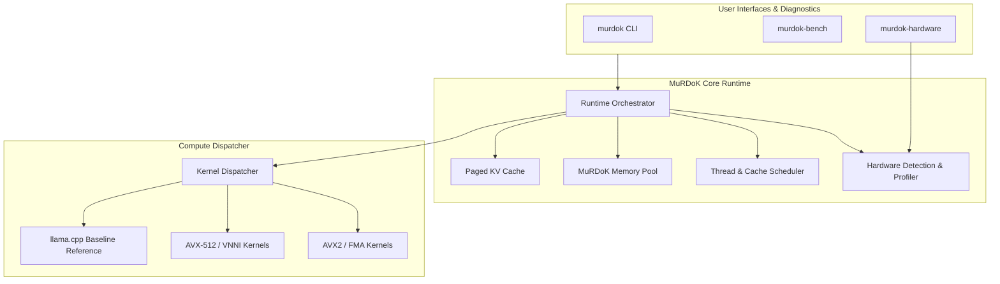

# MuRDoK Inference Engine (MIE)

> **High-performance local LLM inference runtime focused on reducing memory movement, optimizing cache locality, and maximizing tokens-per-second on consumer hardware.**

[](LICENSE)
[](#)
[](#)

---

## 1. What is MuRDoK?

**MuRDoK Inference Engine (MIE)** is an experimental, performance-first local LLM inference engine. While it begins with seamless compatibility with `llama.cpp` and GGUF models, its core mission is to evolve into a dedicated, hardware-adaptive runtime designed around a single architectural truth:

> **In modern autoregressive inference, memory movement is the bottleneck.**

During text generation, every token requires reading the entire model weight tensor into the processor's caches. High FLOP ratings are meaningless if execution units spend hundreds of cycles stalled waiting for DRAM cache lines.

MuRDoK addresses this through:
* **Hardware-Adaptive Topology**: Custom execution profiles tailored to host CPU cache topology (L1/L2/L3), memory bandwidth, and SIMD instruction set.
* **Physical Core Scheduling**: Eliminating context-switch and cache thrashing overhead often caused by indiscriminate hyperthreading.
* **Custom Memory Pooling**: Aligned, zero-allocation execution paths that eliminate runtime dynamic allocation during decoding.
* **Paged & Adaptive KV Cache**: Eliminating memory fragmentation and lowering memory footprint for long contexts.
* **Empirical Benchmarking**: Every optimization is verified against real baseline data. *No optimization by intuition.*

---

## 2. Architecture Overview



---

## 3. Project Structure

```text
murdok-inference-engine/
│
├── CMakeLists.txt              # Root build configuration
├── README.md                   # Project documentation
├── LICENSE                     # Apache 2.0 License
│
├── include/
│   └── murdok/                 # Public C/C++ API headers
│       ├── murdok.h            # Core runtime API
│       └── hardware.h          # Hardware detection interface
│
├── src/
│   ├── hardware/               # CPUID, cache, and memory detection
│   ├── runtime/                # Orchestrator & inference pipeline
│   ├── memory/                 # Custom memory pool and aligned arenas
│   ├── scheduler/              # Physical/logical thread affinity
│   ├── kv/                     # Paged and compressed KV cache
│   └── kernels/                # SIMD-optimized math kernels
│
├── tools/
│   ├── murdok-hardware/        # CLI hardware inspection tool
│   ├── murdok-bench/           # Reproducible benchmark harness
│   └── murdok/                 # Main interactive CLI
│
├── third_party/
│   └── llama.cpp/              # Pristine upstream reference submodule
│
├── benchmarks/
│   ├── BASELINE.md             # Baseline measurements and methodology
│   ├── prompts/                # Standardized test prompts
│   └── results/                # Raw JSON/CSV benchmark outputs
│
└── docs/
    ├── ARCHITECTURE.md         # Detailed architectural design
    └── IMPLEMENTATION_PLAN.md  # Multi-phase roadmap and milestones
```

---

## 4. Building MuRDoK

### Prerequisites
- **C++ Compiler**: MSVC 2022 (Windows), GCC 11+ (Linux), or Clang 14+ (macOS/Linux)
- **CMake**: 3.20 or newer
- **Git**: Configured with submodule support

### Build Instructions (Windows / MSVC)
```powershell
# Clone with submodules
git clone --recurse-submodules https://github.com/murdok1982/murdok-inference-engine.git
cd murdok-inference-engine

# Configure CMake
cmake -B build -S . -G "Visual Studio 17 2022" -A x64

# Build in Release configuration
cmake --build build --config Release
```

---

## 5. Tools & Usage

### Hardware Inspector (`murdok-hardware`)
Inspects host processor features, SIMD capabilities (AVX2, AVX-512, AMX), cache hierarchy (L1/L2/L3), total RAM, and outputs recommended execution profile:
```powershell
.\build\Release\murdok-hardware.exe
```

### Benchmark Harness (`murdok-bench`)
Runs standardized prompt processing and token generation tests, tracking tokens/sec, TTFT, TPOT, and memory usage:
```powershell
.\build\Release\murdok-bench.exe --model models/model.gguf --prompt "Explain cache locality." --tokens 128 --threads 4
```

---

## 6. Development Roadmap

- [x] **Milestone M0**: Baseline environment, hardware inspector, benchmark harness, and baseline data.
- [ ] **Phase 1**: Core runtime API encapsulation & baseline parity.
- [ ] **Phase 2**: Aligned memory pool & cache-aware thread scheduling.
- [ ] **Phase 3**: Weight memory layout & SIMD stride optimization.
- [ ] **Phase 4**: Paged & adaptive KV cache engine.
- [ ] **Phase 5**: Speculative decoding with dynamic draft prediction.
- [ ] **Phase 6**: Static graph execution planning.
- [ ] **Phase 7**: Auto-tuning profile generator.
- [ ] **Phase 8**: Native `.murdok` model binary compiler.

---

## 7. License

Licensed under the [Apache License, Version 2.0](LICENSE).
