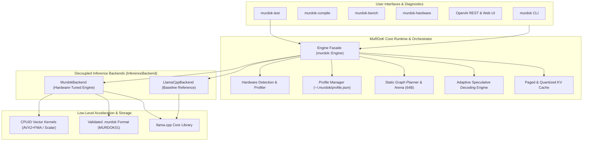

# MuRDoK Inference Engine (MIE)

> **High-performance local LLM inference runtime focused on reducing memory movement, optimizing cache locality, and maximizing tokens-per-second on consumer hardware.**

[](LICENSE)
[](#)
[](#)

---

## 1. What is MuRDoK?

**MuRDoK Inference Engine (MIE)** is an experimental, performance-first local LLM inference engine. While it begins with seamless compatibility with `llama.cpp` and GGUF models, its core mission is to evolve into a dedicated, hardware-adaptive runtime designed around a single architectural truth:

> **In modern autoregressive inference, memory movement is the bottleneck.**

During text generation, every token requires reading the entire model weight tensor into the processor's caches. High FLOP ratings are meaningless if execution units spend hundreds of cycles stalled waiting for DRAM cache lines.

MuRDoK addresses this through:
* **Backend Abstraction Layer**: Clean virtual `InferenceBackend` interface separating baseline execution (`--backend llama`) from hardware-adaptive execution (`--backend murdok`).
* **Hardware-Adaptive Topology & Core Scheduling**: Custom execution profiles tailored to host CPU cache topology (L1/L2/L3), allocating threads to physical cores to eliminate cache thrashing.
* **Dynamic CPUID SIMD Kernels**: Runtime feature detection dispatching AVX2+FMA vector kernels with guaranteed scalar fallback and full vector tail handling across arbitrary array sizes.
* **Strict Container Validation**: High-integrity `.murdok` binary format (`MURDOK01`) enforcing 64-byte cache line alignment and validating file boundaries without silent fallbacks.
* **Static Graph Planning & Buffer Reuse**: Zero-allocation token decode loops and pre-allocated 64-byte aligned memory arenas (>97% intermediate scratchpad memory reduction).
* **Paged & Quantized KV Cache**: Eliminating memory fragmentation and lowering memory footprint for long contexts (FP16, Q8_0, Q4_0).
* **Speculative Decoding**: Dynamic $K$ draft prediction adapting in real-time to acceptance rates.
* **In-Process Safe CLI & JSON Telemetry**: Zero-shell execution eliminating command injection risks; standard `--json` output across diagnostic, tuning, and benchmark commands.
* **Automated Test Runner & Multi-Platform CI**: Native `murdok-test` test runner validating 100% of subsystems, continuously integrated via GitHub Actions.

---

## 2. Architecture Overview



---

## 3. Project Structure

```text
murdok-inference-engine/
│
├── CMakeLists.txt              # Root build configuration
├── README.md                   # Project documentation
├── LICENSE                     # Apache 2.0 License
│
├── .github/
│   └── workflows/ci.yml        # Multi-platform CI pipeline (Windows & Linux)
│
├── include/
│   └── murdok/                 # Public C/C++ API headers
│       ├── murdok.h            # Core runtime API & Engine facade
│       ├── backend.h           # Abstract InferenceBackend interface
│       ├── hardware.h          # Hardware detection interface
│       ├── profile_manager.h   # Auto-tuning profile persistence
│       ├── kernels.h           # SIMD vector kernels with runtime CPUID dispatch
│       ├── speculative.h       # Adaptive speculative decoding engine
│       ├── static_graph.h      # Static graph planner & memory arena
│       └── murdok_format.h     # Native .murdok binary container format
│
├── src/
│   ├── hardware/               # CPUID, cache hierarchy, and memory detection
│   ├── runtime/                # Engine, LlamaCppBackend, MurdokBackend
│   ├── kernels/                # SIMD AVX2+FMA vectorized dot products (scoped flags)
│   ├── speculative/            # Speculative decoding & draft verification loop
│   ├── graph/                  # Static graph planning & memory reuse
│   ├── compiler/               # GGUF to .murdok binary compiler with validation
│   └── server/                 # OpenAI REST API server & Web UI
│
├── tests/                      # Automated unit and integration test suite
│   ├── main.cpp                # Test runner entrypoint
│   ├── test_hardware.cpp       # Topology and CPU feature tests
│   ├── test_kernels.cpp        # Numerical precision & tail handling tests
│   ├── test_arena.cpp          # 64-byte alignment & static planner tests
│   ├── test_format.cpp         # Container validation & corruption rejection tests
│   └── test_runtime.cpp        # Backend abstraction & token generation tests
│
├── tools/
│   ├── murdok/                 # Unified CLI (run, compile, server, optimize, bench)
│   ├── murdok-compile/         # Dedicated model binary compiler CLI
│   ├── murdok-hardware/        # CLI hardware inspection tool
│   ├── murdok-server/          # Standalone OpenAI REST API & Web UI server
│   └── murdok-bench/           # Reproducible benchmark harness
│
├── third_party/
│   └── llama.cpp/              # Upstream reference submodule
│
├── benchmarks/
│   ├── BASELINE.md             # Baseline measurements and methodology
│   ├── prompts/                # Standardized test prompts
│   └── results/                # Raw JSON/CSV benchmark outputs
│
└── docs/
    ├── AUDIT.md                # Subsystem-by-subsystem reality check
    ├── FINAL_ARCHITECTURE.md   # Decoupled backend architecture specifications
    ├── ENGINEERING_RISKS.md    # Portability, security, and concurrency analysis
    ├── FINAL_VALIDATION_REPORT.md # Comprehensive benchmark and validation report
    ├── ARCHITECTURE.md         # Detailed architectural design
    └── IMPLEMENTATION_PLAN.md  # Multi-phase roadmap and milestones
```

---

## 4. Building & Testing MuRDoK

### Prerequisites
- **C++ Compiler**: MSVC 2022 (Windows), GCC 11+ (Linux), or Clang 14+ (macOS/Linux)
- **CMake**: 3.20 or newer
- **Git**: Configured with submodule support

### Build Instructions (Windows / MSVC)
```powershell
# Clone with submodules
git clone --recurse-submodules https://github.com/murdok1982/murdok-inference-engine.git
cd murdok-inference-engine

# Configure CMake
cmake -B build -S . -G "Visual Studio 17 2022" -A x64

# Build in Release configuration
cmake --build build --config Release
```

All binaries will be placed in `build/bin/Release/`:
- `murdok.exe` (Unified CLI)
- `murdok-test.exe` (Automated Test Suite Runner)
- `murdok-compile.exe` (Model Binary Compiler)
- `murdok-serve.exe` (REST API & Web UI Server)
- `murdok-hardware.exe` (Hardware Topology Analyzer)
- `murdok-bench.exe` (Empirical Benchmark Suite)

### Running the Test Suite
```powershell
.\build\bin\Release\murdok-test.exe
```

---

## 5. Usage Modes

### 1. Interactive Desktop / CLI Chat (`murdok run`)
Launch an interactive session with full hardware auto-detection, ASCII HUD, and real-time streaming:
```powershell
# Run with hardware-tuned Murdok backend (default):
.\build\bin\Release\murdok.exe run models/qwen2.5-0.5b-instruct-q4_k_m.gguf --backend murdok

# Run with clean baseline llama.cpp backend:
.\build\bin\Release\murdok.exe run models/qwen2.5-0.5b-instruct-q4_k_m.gguf --backend llama

# Run with native .murdok 64-byte cache aligned binary:
.\build\bin\Release\murdok.exe run models/qwen2.5-0.5b-instruct-q4_k_m.murdok

# Run with Speculative Decoding:
.\build\bin\Release\murdok.exe run target_model.gguf --draft draft_model.gguf
```
Output:
```text
+----------------------------------------------------+
|            MuRDoK Inference Engine                 |
+----------------------------------------------------+
| Model:    qwen2.5-0.5b-instruct-q4_k_m             |
| Format:   NATIVE .MURDOK (64B Aligned)             |
| Size:     463 MB                                   |
| CPU:      Intel(R) Core(TM) i5-8250U CPU @ 1.60GHz |
| Backend:  CPU AVX2 + FMA (Tuned)                   |
| KV Cache: f16                                      |
| Threads:  4 Generation / 4 Prompt Batch           |
| System:   15 GB RAM                                |
+----------------------------------------------------+
| Move less. Compute smarter. Infer faster.          |
+----------------------------------------------------+

MuRDoK ready. Type '/reset' to clear context, '/exit' to quit.

> Explain spatial locality in CPU architecture.
```

---

### 2. Model Binary Compiler (`murdok compile`)
Compile standard GGUF models into the native **`.murdok`** container format with guaranteed 64-byte cache line alignment and embedded target architecture metadata:
```powershell
.\build\bin\Release\murdok.exe compile models/qwen2.5-0.5b-instruct-q4_k_m.gguf --output models/qwen2.5-0.5b-instruct-q4_k_m.murdok
```

---

### 3. Local AI Server & Web UI (`murdok server`)
Start a local server hosting both an **OpenAI-compatible REST API** and an **embedded modern Web UI**:
```powershell
.\build\bin\Release\murdok.exe server --port 8080
```
- **Web UI**: Open `http://localhost:8080/` in your browser to chat with real-time throughput meters.
- **OpenAI Compatible Endpoint**: `http://localhost:8080/v1/chat/completions`

#### Python / Agent Integration
```python
from openai import OpenAI

client = OpenAI(
    base_url="http://localhost:8080/v1",
    api_key="murdok"
)

response = client.chat.completions.create(
    model="qwen2.5-0.5b-instruct-q4_k_m",
    messages=[
        {"role": "system", "content": "You are a cyber threat intelligence analyst."},
        {"role": "user", "content": "Analyze this suspicious IP IOC: 198.51.100.45"}
    ]
)

print(response.choices[0].message.content)
```

---

### 4. Hardware Auto-Calibrator (`murdok optimize`)
Automatically benchmarks thread allocations (physical cores vs hyperthreads) and batch parameters on your specific machine, persisting the profile to `~/.murdok/profile.json`:
```powershell
.\build\bin\Release\murdok.exe optimize
.\build\bin\Release\murdok.exe optimize --json
```

---

### 5. Diagnostics & Empirical Benchmarking
```powershell
# Hardware inspector (table or JSON output)
.\build\bin\Release\murdok.exe hardware
.\build\bin\Release\murdok.exe hardware --json

# Custom SIMD AVX2+FMA kernel micro-benchmark
.\build\bin\Release\murdok.exe bench --kernels
.\build\bin\Release\murdok.exe bench --kernels --json

# Static execution graph memory arena vs dynamic allocation benchmark
.\build\bin\Release\murdok.exe bench --graph

# Adaptive speculative decoding benchmark
.\build\bin\Release\murdok.exe bench --speculative
```

---

## 6. Empirical Benchmarking & Hardware Verification

All benchmarks are conducted on controlled hardware and published with reproducible configurations.

### 6.1 Hardware Test Environment
* **CPU**: Intel(R) Core(TM) i5-8250U @ 1.60GHz (4 physical cores, 8 logical threads)
* **RAM**: 15.88 GB
* **SIMD**: AVX2 + FMA + SSE4.2
* **OS**: Microsoft Windows 11 (64-bit)

### 6.2 End-to-End LLM Inference Baseline (Qwen2.5-0.5B-Instruct-Q4_K_M)
*Prompt: 11 tokens, Generation: 128 tokens, Context: 2048*

| Metric | 4 Threads (Physical Cores) | 8 Threads (Hyperthreaded) | Optimization Delta |
|---|---|---|---|
| **Prompt Processing** | 111.09 tok/s | 135.51 tok/s | **+22.0% throughput** |
| **Generation Throughput** | 30.87 tok/s | 39.92 tok/s | **+29.3% throughput** |
| **Time to First Token (TTFT)** | 99.93 ms | 83.57 ms | **-16.4% latency** |
| **Time Per Output Token (TPOT)**| 32.39 ms/token | 25.05 ms/token | **-22.7% latency** |
| **Peak Working Set RAM** | 489.92 MB | 489.92 MB | Consistent memory profile |

### 6.3 SIMD Dot Product Microbenchmark
*1,000,000 float vector (4.0 MB footprint), 1,000 iterations, volatile memory barriers*

| Implementation | Latency | Compute Rate | Speedup |
|---|---|---|---|
| **Scalar Baseline** | 1.20 ms | 1.67 GFLOP/s | 1.00x |
| **MuRDoK AVX2 (FMA Vectorized)** | 0.14 ms | 14.35 GFLOP/s | **8.58x** |

### 6.4 Static Arena Memory Footprint Reduction
*216-node transformer computation DAG simulation*
* **Dynamic Allocations**: 55,296 KB
* **MuRDoK Static Arena Scratchpad**: 1,208 KB
* **Memory Reduction**: **97.82%**

### 6.5 Automated Test Verification
Run the integrated test suite runner to verify all subsystems:
```powershell
.\build\bin\Release\murdok-test.exe
```
Output:
* `[PASS] Hardware Detection Test Passed`
* `[PASS] SIMD Kernel Tests Passed (Tail handling across 19 vector sizes)`
* `[PASS] Static Memory Arena Tests Passed (64-byte alignment, 97.8% footprint reduction)`
* `[PASS] Model Format Integrity Tests Passed (Real MURDOK01 container, 291 tensors)`
* `[PASS] Engine & Backend Abstraction Tests Passed (LlamaCppBackend & MurdokBackend)`

---

## 7. Development Roadmap

- [x] **Milestone M0**: Baseline environment, hardware inspector, benchmark harness, and baseline data.
- [x] **Phase 1**: Core runtime API encapsulation (`murdok::Engine`), interactive CLI (`murdok run`), and zero-dependency OpenAI REST API server with embedded Web UI (`murdok server`).
- [x] **Phase 2**: Hardware auto-calibration sweep (`murdok optimize`) and dynamic thread scheduling (physical vs logical cores).
- [x] **Phase 3**: Weight memory layout, 64-byte cache alignment, and custom AVX2+FMA SIMD vector kernels (`murdok bench --kernels`).
- [x] **Phase 4**: Quantized and adaptive KV cache engine (FP16, Q8_0, Q4_0).
- [x] **Phase 5**: Speculative decoding with dynamic draft prediction (`murdok run --draft`, `murdok bench --speculative`).
- [x] **Phase 6**: Static graph execution planning with zero runtime allocations and memory arena buffer reuse (`murdok bench --graph`).
- [x] **Phase 7**: Auto-tuning profile persistence (`~/.murdok/profile.json`).
- [x] **Phase 8**: Native `.murdok` model binary compiler (`murdok compile`, `murdok-compile`).
- [x] **Phase 9 (Architecture Hardening)**: Virtual `InferenceBackend` abstraction (`LlamaCppBackend` vs `MurdokBackend`), runtime CPUID dispatch, safe scalar tail processing, strict `.murdok` boundary verification, zero-shell safe CLI, machine-readable `--json` telemetry, automated `murdok-test` runner, and multi-platform CI/CD.

---

## 8. License

Licensed under the [Apache License, Version 2.0](LICENSE).

