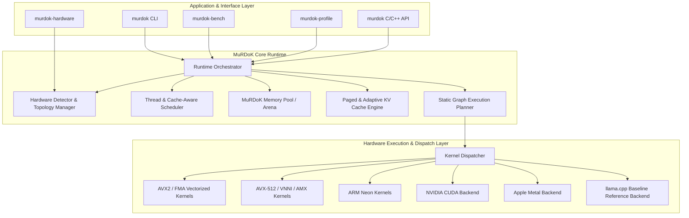

# MuRDoK Inference Engine — System Architecture

```text
==========================================================================
              MuRDoK INFERENCE ENGINE (MIE) ARCHITECTURE
       "Move less. Compute smarter. Infer faster. Benchmark always."
==========================================================================
```

## 1. Vision and Architectural Principles

MuRDoK Inference Engine is engineered from the ground up on one core principle:
**In modern LLM inference, memory movement is the primary bottleneck.** 

During autoregressive token generation, weights must be streamed through the processor for every single generated token (Memory Bandwidth Bound). Arithmetic compute (FLOPs) is frequently starved waiting for memory lines from DRAM.

MuRDoK's architecture addresses this through:
1. **Minimizing Memory Movement**: Tightly packed tensors, hardware-specific strides, zero-copy buffers.
2. **Cache Locality & Hierarchy Matching**: Structuring data and compute to maximize L1D, L2, and L3 cache residence.
3. **Adaptive Hardware Awareness**: Detecting exact host topology (cores, hyperthreads, cache sizes, SIMD extensions) and selecting optimized execution paths automatically.
4. **Static Graph Planning & Buffer Reuse**: Eliminating allocation/deallocation in the generation loop.
5. **Paged & Compressed KV Cache**: Dynamic memory management preventing fragmentation and out-of-memory states under long context windows.
6. **Empirical Benchmarking**: Never optimizing by intuition. Every single architectural enhancement must prove its gain against a clean `llama.cpp` baseline.

---

## 2. Layered Architecture



---

## 3. Subsystem Breakdown

### 3.1 Hardware Detection (`src/hardware/` & `include/murdok/hardware.h`)
The hardware module performs direct CPUID queries, cache topology discovery, and memory sizing:
- **Processor Identification**: Vendor, model, physical core count, logical thread count.
- **SIMD Capabilities**: AVX, AVX2, FMA, AVX-512 (F, CD, BW, DQ, VL), VNNI, AMX, ARM Neon.
- **Cache Topology**: L1 Data, L1 Instruction, L2, and L3 cache capacities and line sizes.
- **System Memory**: Total physical RAM, available RAM, NUMA node assignment.
- **Execution Profiles**:
  - `MURDOK_PROFILE_BALANCED`: Safe, balanced throughput/latency.
  - `MURDOK_PROFILE_CPU_PERFORMANCE`: Physical cores pinned, aggressive prefetch, AVX2/AVX512.
  - `MURDOK_PROFILE_LOW_MEMORY`: Compressed KV cache, smaller page sizes.
  - `MURDOK_PROFILE_HYBRID`: Offloaded prompt processing, CPU generation.

### 3.2 Thread Scheduler (`src/scheduler/`)
Conventional schedulers often bind `threads = logical_cores`, leading to hyperthreading cache thrashing and context switching penalty on memory-bound workloads.
MuRDoK's scheduler distinguishes:
- Physical vs. Logical cores.
- Thread affinity to specific core clusters sharing L2/L3 caches.
- Dynamic thread tuning based on prompt processing (compute-bound $\to$ all threads) vs. autoregressive token generation (bandwidth-bound $\to$ physical cores only).

### 3.3 Memory Pool & Allocator (`src/memory/`)
Inference loops should never invoke standard OS `malloc()` / `free()`.
- **Preallocated Arenas**: Continuous virtual memory regions aligned to cache-line (64 bytes) or page boundaries (4 KB / 2 MB huge pages).
- **Tensor Reuse Plan**: Buffers are statically planned so intermediate activation tensors reuse memory slots as soon as downstream consumers finish.

### 3.4 Paged KV Cache Engine (`src/kv/`)
Instead of a single monolithic memory allocation for $N$ context tokens:
- **Page Allocation**: Context KV pairs are grouped in fixed-size blocks (pages).
- **Adaptive Precision**: Recent tokens kept in FP16/BF16; historical tokens quantized to INT8/INT4.
- **Zero-fragmentation**: Dynamic block table translation.

### 3.5 Benchmark & Baseline Harness (`tools/murdok-bench/`)
MuRDoK includes a native benchmarking tool designed to measure:
- **Prompt Processing**: tokens per second ($T_{\text{prompt}}$).
- **Autoregressive Generation**: tokens per second ($T_{\text{gen}}$).
- **Time to First Token (TTFT)** in milliseconds.
- **Time per Output Token (TPOT)** in milliseconds.
- **Peak Working Set Memory** (RAM consumption).
- Direct Delta (%) comparing MuRDoK optimizations vs. standard `llama.cpp` baseline under identical hardware and prompt conditions.
