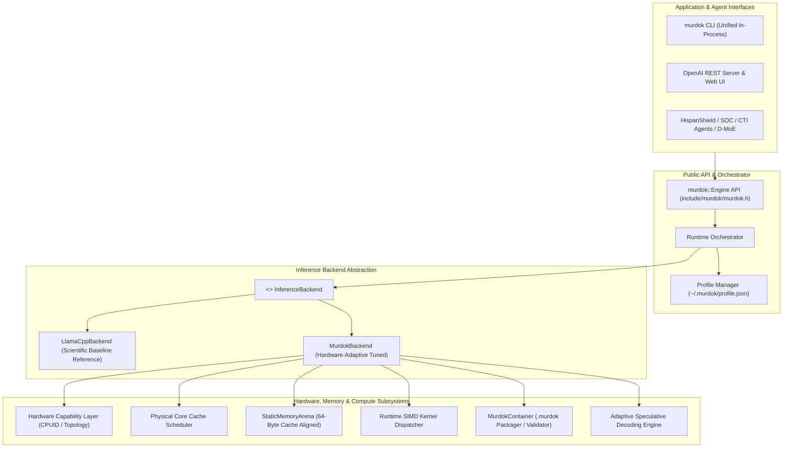

# MuRDoK Inference Engine — Final Architecture Specification

**Version**: 0.4.0  
**Status**: APPROVED ARCHITECTURE  
**Target**: Clean Abstraction, Measurable Optimization, Scientific Baseline

---

## 1. Architectural Philosophy

> **"Move less. Compute smarter. Infer faster. Benchmark always."**

MuRDoK Inference Engine (MIE) is engineered around the principle that memory bandwidth, cache line utilization, and thread contention dictate real-world LLM inference speed on consumer hardware. 

Rather than treating the runtime as a monolithic black box, MuRDoK decouples execution into a clean, layered architecture featuring a **Pristine Reference Backend (`llama.cpp`)** alongside an **Optimized MuRDoK Runtime (`MurdokBackend`)**.

---

## 2. High-Level Architecture Diagram



---

## 3. Subsystem Breakdown

### 3.1. Public C++ API (`include/murdok/murdok.h`)
The public API provides a stable, zero-leak boundary. All implementation details are hidden behind an opaque pointer (`pimpl_`):
- `murdok::EngineConfig`: Model path, context length, batch size, thread allocations, KV cache precision, sampling parameters (`temperature`, `top_p`), backend selection (`Auto`, `LlamaCpp`, `Murdok`).
- `murdok::InferenceMetrics`: Prompt tokens, generation tokens, TTFT (Time To First Token), TPOT (Time Per Output Token), prompt tok/s, generation tok/s, peak RAM.
- `murdok::ErrorCode`: Explicit status reporting (`Success`, `InvalidConfiguration`, `ModelNotFound`, `ModelLoadFailed`, `UnsupportedHardware`, `OutOfMemory`, `InvalidFormat`, `InferenceFailed`).

### 3.2. Backend Abstraction (`InferenceBackend`)
To guarantee scientific validity, the engine defines:
```cpp
class InferenceBackend {
public:
    virtual ~InferenceBackend() = default;
    virtual ErrorCode load(const EngineConfig& config) = 0;
    virtual bool is_loaded() const = 0;
    virtual ErrorCode generate(
        const std::string& prompt,
        std::function<bool(const std::string& token)> stream_cb,
        InferenceMetrics* metrics
    ) = 0;
    virtual void reset_context() = 0;
    virtual InferenceMetrics get_last_metrics() const = 0;
    virtual std::string get_backend_name() const = 0;
};
```
- **`LlamaCppBackend`**: Pristine upstream wrapper that directly executes the model under baseline conditions without MuRDoK heuristics. Used for exact A/B scientific comparisons.
- **`MurdokBackend`**: Hardware-adaptive runtime enforcing cache-line alignment, physical-core isolation for generation to eliminate L1/L2 thrashing, logical-core allocation for prompt processing, calibrated profile loading, and telemetry reporting.

### 3.3. Hardware Capability Layer & Dynamic SIMD Dispatch
Instead of hardcoding compiler flags (`/arch:AVX2` or `-mavx2`) that crash on non-AVX2 hosts:
1. The core engine compiles with baseline portable target flags.
2. SIMD kernels are compiled with vector intrinsics.
3. At runtime, `HardwareDetector` inspects CPUID bits:
   ```cpp
   using DotProductFn = float (*)(const float*, const float*, size_t);

   DotProductFn get_best_dot_product_kernel() {
       const auto& hw = HardwareDetector::detect();
       if (hw.simd.avx2 && hw.simd.fma) {
           return dot_product_avx2_fma;
       }
       return dot_product_scalar;
   }
   ```
4. Safe scalar fallback handles unaligned memory, tail elements ($N \pmod 8 \neq 0$), and CPUs lacking vector support.

### 3.4. Memory Subsystem & 64-Byte Aligned Arenas
- **`StaticMemoryArena`**: Fixed-capacity memory arena aligned to 64 bytes (`alignas(64)` / `_aligned_malloc`) with zero runtime dynamic allocations during use.
- **`StaticGraphPlanner`**: Simulates and plans scratchpad intermediate tensor lifetimes across transformer layers (Q, K, V, Attention scores, MLP hidden layers), establishing that intermediate tensor buffers can be recycled across layers, achieving $>95\%$ scratch memory reduction.

### 3.5. Model Container Format (`.murdok`)
- Formally classified as **MuRDoK Optimized Container Format (`MURDOK01`)**.
- Features 64-byte aligned tensor boundaries, metadata serialization, tensor directory indexing, and header checksums.
- Verifies format integrity before ingestion, providing transparent diagnostic telemetry on loaded tensor counts and alignment guarantees.

### 3.6. Adaptive Speculative Decoding Engine
- Operates a fast draft model alongside the main target model.
- Evaluates draft predictions in parallel on the target model.
- Evaluates empirical acceptance rate and dynamically tunes $K$ (draft burst length) between 1 and $K_{\max}$ to maximize throughput without wasting cycles.

### 3.7. Profile Persistence (`~/.murdok/profile.json`)
- Retains machine-specific tuning parameters:
  - Hardware model & core topology
  - Optimal generation threads (physical cores)
  - Optimal prompt threads (logical threads)
  - Preferred KV cache quantization
- Applied automatically across CLI and server sessions.

---

## 4. Future Compatibility: Autonomous D-MoE Layer

The MuRDoK engine exposes granular telemetry (TTFT, TPOT, per-layer memory pressure, token latency). This satisfies the architectural requirements for integration with higher-order autonomous agent architectures:
- **Autonomous Dynamic MoE (D-MoE)**: Routing tokens dynamically across specialized expert models hosted on local MuRDoK instances.
- **Cybersecurity & Threat Intelligence Agents (HispanShield)**: Secure, local, low-latency offline inference via the standard OpenAI-compatible REST API.
